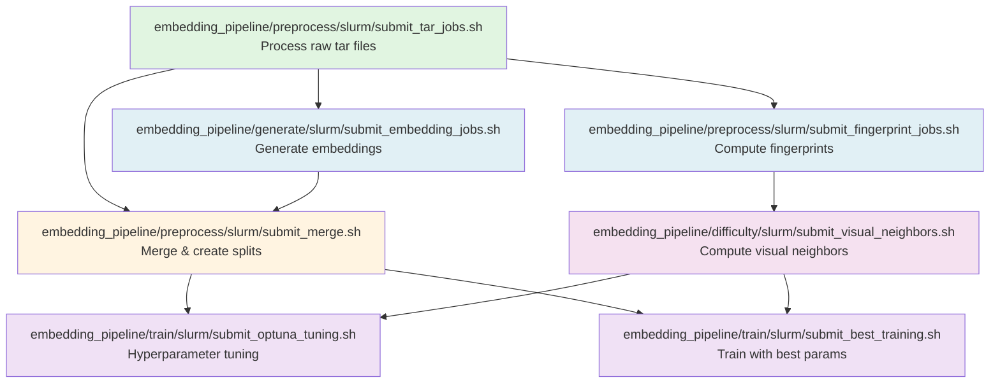

## Spatial Building Embeddings

A unified pipeline for generating and training specialized building embeddings from the 3D Street View dataset.

- **Dataset scale**: 1,006,160 unique buildings and 5,772,534 unique images across the combined train, validation, and test partitions.

## Project Structure

This repository is organized into two main components:

### 1. **`embedding_pipeline/`** - Embedding Model Development (Current Phase)
Complete pipeline for generating, training, and publishing specialized building embeddings:
- **`preprocess/`** - Extract and normalize raw tar files into structured Parquet format
- **`generate/`** - Generate embeddings using pre-trained Vision Transformer models (DINOv2/DINOv3)
- **`difficulty/`** - Compute visual similarity bands for intelligent negative sampling
- **`train/`** - Train specialized projection head using triplet loss
- **`publish/`** - Export trained models to Hugging Face format

See [`embedding_pipeline/README.md`](embedding_pipeline/README.md) for detailed documentation.

### 2. **`clustering/`** - Clustering Phase (Future Work)
Reserved for the next phase: clustering the specialized embeddings with additional datasets. See [`clustering/README.md`](clustering/README.md) for planned functionality.

### 3. **`download_raw_data/`** - Shared Utilities
Scripts for downloading the 3D Street View dataset using aria2c.

## Pipeline Execution Order

The following graph shows the dependency relationships between all `submit_*.sh` scripts. Execute them in the order indicated by the arrows (scripts at the top/left must complete before those below/right):

## Configuration

All workflows use the unified `config.toml` file in the repository root. See the file for configuration options organized by section:
- `[global]` - Shared settings (seed, log directory)
- `[paths]` - Data directory paths
- `[embedding_model]` - DINOv2/v3 model settings
- `[training_model]` - Projection head architecture
- `[training]` - Training hyperparameters
- `[data]` - Data processing settings
- `[infrastructure]` - Device and performance settings
- `[logging]` - Logging and monitoring (W&B)

