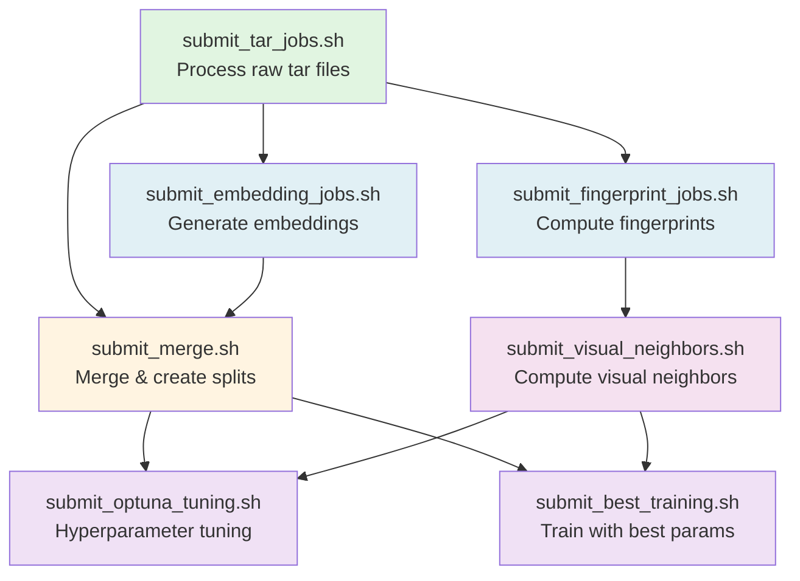

## Spatial Building Embeddings

- **Dataset scale**: 1,006,160 unique buildings and 5,772,534 unique images across the combined train, validation, and test partitions.

### Pipeline Execution Order

The following graph shows the dependency relationships between all `submit_*.sh` scripts. Execute them in the order indicated by the arrows (scripts at the top/left must complete before those below/right):

