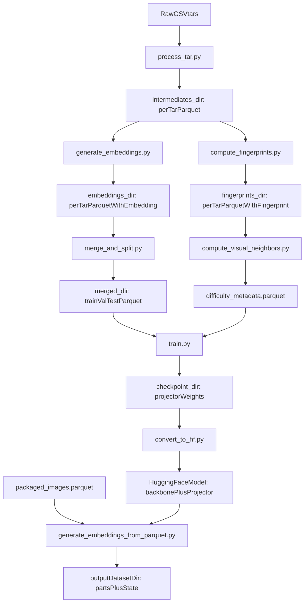
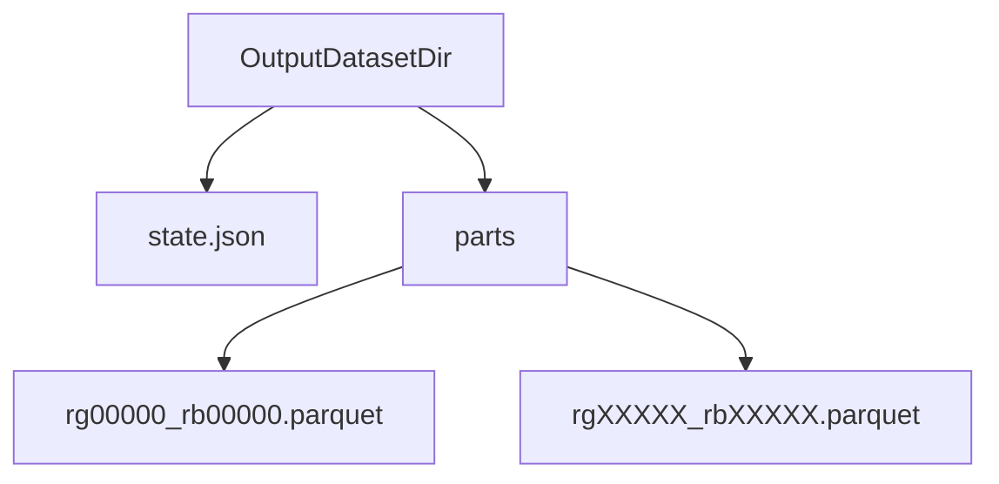

## Spatial Building Embeddings: What They Are, How They’re Built, and the Data Architecture

This document is a collaborator-facing reference for the **Spatial Building Embeddings** produced by this repo and for the **final embeddings generated on new data** via `publish_model/slurm/generate_embeddings_from_parquet.sbatch`.

The modality throughout is **Google Street View imagery of buildings** (facades captured from street-level viewpoints).

### Summary

- **Unit of embedding**: **one street-view image** (per-image, not per-building aggregated).
- **Final embedding**: **256-dimensional**, **float**, **L2-normalized** vector (norm \(\approx 1\)). These are the vectors you should index / search / cluster.
- **Intended behavior**: images of the **same building** (captured from multiple angles / viewpoints) should land close together; different buildings should land farther apart.
- **Model shape**: a **pretrained vision backbone** (DINOv2/DINOv3 family; concrete choice is config-driven) plus a **trained MLP projection head** (“projector”) trained with triplet loss to specialize for building identity.
- **New-data embedding job**: consumes a parquet of packaged images (bytes) and writes a **resumable parquet dataset directory** with `parts/*.parquet` containing `(OSMID, embedding)`.
- **What “final embeddings” refers to in practice**: per-image embeddings generated for a **random sample of North America building Street View images**.
- **Training dataset scale (original pipeline)**: on the order of **~1.0M unique buildings** and **~5.8M images** across train/val/test (see root `README.md` for the current reported counts).

### End-to-end pipeline (high level)



## (a) What these embeddings are

### Two representations: backbone vs specialized (“final”) embedding

There are two related vectors to keep straight:

- **Backbone embedding (pretrained)**: a pooled representation produced by the pretrained vision backbone (e.g., DINOv2/DINOv3). Its dimensionality depends on the backbone (e.g., DINOv3 ViT-7B yields 4096-dim pooled features; see `[embedding_model]` and `[training_model]` in `config.toml`).
- **Specialized embedding (final)**: the projector head transforms the backbone features into a **256-dim** vector and then applies **L2-normalization**. This is the output used for retrieval / similarity.

In the published model implementation, the specialization happens in:

- `publish_model/modeling_spatial_embeddings.py`
  - backbone pooling: prefers `outputs.pooler_output` if available, otherwise uses CLS token from `last_hidden_state[:, 0]`
  - projector output is **L2-normalized** with `F.normalize(..., p=2, dim=1)`

Concrete (current repo config):

- `config.toml` currently uses a DINOv3 backbone (`[embedding_model].model_name = "facebook/dinov3-vit7b16-pretrain-lvd1689m"`) with pooled feature dim **4096** and a projector output dim **256** (`[training_model].input_dim = 4096`, `[training_model].output_dim = 256`).

### Similarity / distance semantics

Because the final embeddings are L2-normalized:

- **Cosine similarity** between two embeddings is approximately their **dot product**.
- **Euclidean distance** and cosine distance are monotonically related on the unit hypersphere, so either can work for nearest-neighbor search (choose one and be consistent).

### What the model does and does not use

- **Uses**: the image content (appearance/texture/structure) of a building as seen from street view; viewpoint changes are expected.
- **Does not explicitly use at inference time**: the lat/lon fields that exist in the preprocessing metadata. Those fields are present as metadata in some parquet artifacts but are not part of the forward pass of the published image model.

### Training objective (why it works for “same building”)

The projection head is trained with triplet loss so that:

- **Anchor** and **positive** are two different images of the **same building** (different angles/viewpoints).
- **Negative** is an image from a **different building**, sampled to mix “easy” and “hard” negatives (using difficulty bands).

This is what makes the final embedding specialize for building identity vs a generic vision embedding.

## (b) How they were constructed

### 1) Raw data: Google Street View building tar archives

Each `.tar` contains a directory structure with paired `.jpg/.jpeg` and `.txt` metadata files.
See `preprocess_raw_data/raw_data_structure.md` for details.

The metadata `.txt` includes a `d` line with identifiers and geometry/camera fields; the pipeline keeps only identifiers and target lat/lon.

### 2) `process_tar.py`: tar → intermediate parquet

Script: `preprocess_raw_data/process_tar.py`

What it does:

- Extracts a tar to a temp dir.
- For each metadata entry, validates there is a corresponding readable image.
- Writes **one parquet per tar** into `intermediates_dir`.

Intermediate parquet columns (generated in `process_tar.py`):

- `dataset_id` (int)
- `target_id` (int) — building identity within a dataset shard
- `patch_id` (int) — per-image identifier within shard
- `street_view_id` (int)
- `target_lat` (float)
- `target_lon` (float)
- `building_id` (str): `"{dataset_id:04d}_{target_id}"`
- `streetview_image_id` (str): `"{dataset_id:04d}_{patch_id}"`
- `image_path` (str): relative path inside extracted tar
- `tar_file` (str): tar filename

### 3) `generate_embeddings.py`: intermediate parquet (+ tar) → per-image backbone embeddings

Script: `generate_embeddings/generate_embeddings.py`

What it does:

- Reads an intermediate parquet.
- Extracts the corresponding tar.
- Loads a Hugging Face vision model via `transformers.AutoModel` (GPU required).
- Runs batched inference and writes an output parquet containing all retained rows plus an `embedding` column.

Important configuration knobs:

- `config.toml` → `[embedding_model]`:
  - `model_name` (e.g. `facebook/dinov3-vit7b16-pretrain-lvd1689m`)
  - `pooling_type` (`pooler_output` vs `cls_token`)
  - `batch_size`

Embedding parquet columns:

- All intermediate columns listed above, plus:
  - `embedding` (list[float]) — backbone pooled representation

### 4) `merge_and_split.py`: build train/val/test parquet splits for projector training

Script: `preprocess_raw_data/merge_and_split.py`

What it does:

- Reads all `*_embeddings.parquet` files under `embeddings_dir` as a PyArrow dataset.
- Filters **singleton buildings** (buildings with only one image) because triplets require \(\ge 2\) images per building.
- Creates deterministic train/val/test splits **by `building_id`** (prevents building leakage across splits).
- Writes `train.parquet`, `val.parquet`, `test.parquet` to `merged_dir`.
- Drops `tar_file` and `image_path` from the merged splits.

Merged split parquet columns (conceptually):

- identifiers: `dataset_id`, `target_id`, `patch_id`, `street_view_id`
- location metadata: `target_lat`, `target_lon`
- composite identifiers: `building_id`, `streetview_image_id`
- `embedding` (list[float]) — backbone pooled representation used as input to the projector training

### 5) Difficulty metadata (for guided negative sampling)

This repo’s triplet sampling can use “difficulty bands” to choose negatives that are sometimes visually similar (hard) and sometimes dissimilar (easy).

Pipeline:

1. `preprocess_raw_data/compute_fingerprints.py` creates compact pixel fingerprints:
   - Reads intermediate parquet + extracts tar
   - Resizes images to `image_size x image_size` (default 16×16)
   - Stores a `fingerprint` array per row

2. `difficulty_metadata/compute_visual_neighbors.py` computes neighbors in fingerprint space:
   - Loads all fingerprint parquet files
   - PCA to `pca_components` dims
   - BallTree nearest neighbors (excluding same-building)
   - Calibrates band edges and assigns a band per neighbor
   - Writes a single `difficulty_metadata.parquet`

Difficulty metadata parquet schema:

- `target_coord_hash` (str): **actually used as the per-image key**; for the visual pipeline it stores `streetview_image_id`
- `neighbor_building_ids` (list[str])
- `neighbor_distances_meters` (list[float]): **visual-space distances** (name is historical)
- `neighbor_bands` (list[int])

### 6) Triplet training: projector head specialization

Entry point: `train_specialized_embeddings/train.py`

High-level behavior:

- Input: merged split parquets (train/val) containing `building_id` + `embedding`
- Uses triplet loss to train a projector from backbone dim → 256
- In-code behavior:
  - anchor/positive are two different images from the same `building_id`
  - negatives are sampled using difficulty metadata bands (see `train_specialized_embeddings/datasets.py`)

### 7) Publishing: build a single HF model (backbone + trained projector)

Script: `publish_model/convert_to_hf.py`

What it does:

- Loads the training config to get projector hyperparameters.
- Loads the embedding config to get the backbone model name (`embed_config.model_name` from `config.toml`).
- Loads projector weights from `checkpoint_best.pt`.
- Infers key projector architecture fields from the checkpoint weights (e.g., `input_dim`, `output_dim`, number of hidden layers), and uses the config for fields that are not inferable from weights (e.g., dropout, activation).
- Saves a Transformers-compatible model directory that includes:
  - `publish_model/modeling_spatial_embeddings.py`
  - `publish_model/configuration_spatial_embeddings.py`

This published model is what `AutoModel.from_pretrained(..., trust_remote_code=True)` loads.

### 8) Final embeddings on new data: packaged parquet → embeddings dataset directory

Script: `publish_model/generate_embeddings_from_parquet.py`
SLURM wrapper: `publish_model/slurm/generate_embeddings_from_parquet.sbatch` (submitted via `publish_model/slurm/submit_embeddings_from_parquet.sh`)

Input expectation (minimum):

- `packaged_images.parquet` contains:
  - `image_bytes` (bytes) — JPEG bytes for the image
  - `OSMID` (any scalar type) — identifier carried through to output
  - optional `is_valid` (bool) — if present, rows with `is_valid=False` are skipped unless `--no-filter-valid` is used

Output:

- A **parquet dataset directory** (not a single `.parquet` file) for resumability/atomicity:
  - `state.json` (records input path, model id, and progress counters)
  - `parts/rgXXXXX_rbXXXXX.parquet` part files, each containing:
    - `OSMID`
    - `embedding` (list[float32]) — **final embeddings** from the published model (expected 256-D for this repo’s model); vectors are L2-normalized by the projector

Notes:

- `OSMID` is treated as an opaque identifier and is carried through unchanged. If your input has multiple images per `OSMID` and you want a **per-building** embedding, a common approach is to average the per-image embeddings for that `OSMID` and then L2-normalize the result.

Output layout:



## (c) Data architecture

### Config-driven “where things live”

The core directories/paths are configured in `config.toml`:

- `[paths].intermediates_dir`: per-tar intermediate parquet outputs from `process_tar.py`
- `[paths].embeddings_dir`: per-tar backbone embedding parquet outputs from `generate_embeddings.py`
- `[paths].merged_dir`: merged `train.parquet`, `val.parquet`, `test.parquet` from `merge_and_split.py`
- `[paths].fingerprints_dir`: per-tar fingerprint parquet outputs from `compute_fingerprints.py`
- `[paths].difficulty_metadata_path`: single difficulty parquet output from `compute_visual_neighbors.py`
- `[paths].checkpoint_dir`: training checkpoints (projector weights)

Note: the “final embeddings on new data” pipeline writes wherever you point `--output` in `publish_model/generate_embeddings_from_parquet.py` and is not controlled by `config.toml`.

### Artifact inventory (what you should expect to exist)

- **Raw**:
  - `*.tar` (Google Street View imagery + `.txt` metadata)
- **Intermediate** (`intermediates_dir`):
  - `####.parquet` — one per tar
- **Backbone embeddings** (`embeddings_dir`):
  - `####_embeddings.parquet` — one per tar
- **Merged splits** (`merged_dir`):
  - `train.parquet`, `val.parquet`, `test.parquet`
- **Fingerprints** (`fingerprints_dir`):
  - `####_fingerprints.parquet`
- **Difficulty**:
  - `difficulty_metadata.parquet`
- **Projector checkpoints** (`checkpoint_dir`):
  - `checkpoint_best.pt`, `checkpoint_epoch_*.pt`, etc.
- **Published model**:
  - a Transformers model folder (local or pushed to HF), containing custom modeling/config python files
- **New-data embedding outputs**:
  - `<output>.parts/` (or `<output>/` if `<output>` is a directory) containing `state.json` and `parts/*.parquet`

## Repro commands (common collaborator workflows)

### Generate embeddings on new data (cluster)

```bash
./publish_model/slurm/submit_embeddings_from_parquet.sh \
  --account <ACCOUNT> \
  --input /path/to/packaged_images.parquet \
  --output /path/to/embeddings.parquet \
  --model-id alexwaolson/spatial-building-embeddings \
  --batch-size 32
```

### Generate embeddings on new data (local, direct python)

```bash
uv run python publish_model/generate_embeddings_from_parquet.py \
  --input /path/to/packaged_images.parquet \
  --output /path/to/embeddings.parquet \
  --model-id alexwaolson/spatial-building-embeddings \
  --device auto
```

## Operational notes / pitfalls

- **GPU is effectively required** for reasonable throughput, especially for large backbones (e.g., DINOv3 ViT-7B). The SLURM script enforces GPU availability.
- **VRAM / batch sizing**: large backbones may require large VRAM; treat `--batch-size` as a throughput knob constrained by GPU memory (the provided SLURM scripts are tuned for H100-class GPUs).
- **Resume behavior**: `publish_model/generate_embeddings_from_parquet.py` writes deterministic part filenames and skips existing parts. It also maintains `state.json` and avoids clobbering an existing output file by writing to a sidecar directory `<output>.parts`.
- **HF caching on cluster**: the SLURM script sets `HF_HOME`/`TRANSFORMERS_CACHE` under `$SCRATCH` to avoid filling home-directory quotas.
- **Authentication**: if you point `--model-id` at a gated/private model, you’ll need `HF_TOKEN` available to the job environment.
- **`neighbor_distances_meters` is not meters** in the visual difficulty pipeline; it is Euclidean distance in PCA-reduced fingerprint space. Treat it as a relative visual distance.
- **Backbone naming (DINOv2 vs DINOv3)**: text in older READMEs may mention DINOv2, but the *actual* published backbone is determined by `config.toml` at publish time and is recorded in `model.config.backbone_model_name`.
- **`target_coord_hash` naming**: in the visual difficulty metadata output, `target_coord_hash` is used as a legacy key name and actually stores `streetview_image_id` (per-image key).

## Data provenance / constraints note (Google Street View)

- The underlying images are **Google Street View**. Keep track of how images were obtained, stored, and redistributed; any downstream project should be mindful of licensing/terms-of-service and dataset governance. This document is not legal advice; it’s a reminder to treat provenance and redistribution constraints as first-class requirements.

